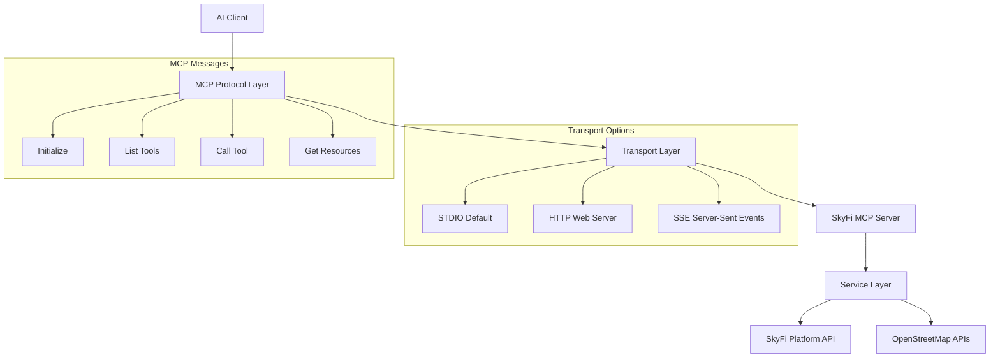
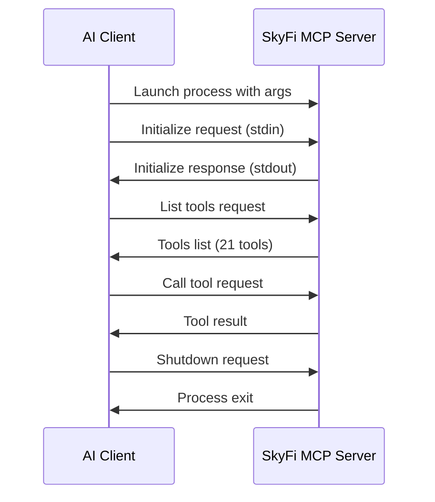

# Model Context Protocol & Transport Layer

Understanding how SkyFi MCP Server communicates with AI clients through the Model Context Protocol (MCP) and its transport mechanisms.

## Overview

The **Model Context Protocol (MCP)** is a standardized protocol that enables AI applications to securely connect to external data sources and tools. SkyFi MCP Server implements this protocol to provide satellite imagery capabilities to AI clients like Claude Desktop, Cursor, Windsurf, and VSCode.

## Protocol Architecture



## STDIO Transport (Default)

**STDIO** (Standard Input/Output) is the primary transport method for MCP communication, providing direct process-to-process communication between the AI client and the MCP server.

### How STDIO Works

1. **Process Launch**: The AI client launches the MCP server as a subprocess
2. **JSON-RPC Communication**: Messages are exchanged via stdin/stdout using JSON-RPC 2.0 format
3. **Bidirectional Streaming**: Real-time communication through standard Unix pipes
4. **Process Management**: The client manages the server lifecycle

### STDIO Message Flow



### STDIO Configuration

```json
{
  "mcpServers": {
    "skyfi": {
      "command": "/full/path/to/python",
      "args": ["-m", "mcp_skyfi"],
      "env": {
        "SKYFI_API_KEY": "your-email@example.com:your-api-key-hash"
      },
      "cwd": "/full/path/to/project"
    }
  }
}
```

### Why STDIO is Default

- **Performance**: Direct process communication with minimal overhead
- **Security**: No network ports or external connections required
- **Simplicity**: Standard Unix IPC mechanism
- **Reliability**: Built-in process lifecycle management
- **Native Support**: All MCP clients support STDIO out of the box

## HTTP Transport

HTTP transport runs the MCP server as a web server, useful for browser-based clients or remote access.

### HTTP Configuration

```bash
# Start HTTP server
python -m mcp_skyfi --transport http --port 8000

# Test endpoint
curl http://localhost:8000/health
```

### HTTP vs STDIO Comparison

| Feature | STDIO | HTTP |
|---------|-------|------|
| **Performance** | Fast (direct IPC) | Slower (network overhead) |
| **Security** | Process-local | Network-exposed |
| **Setup** | Simple | Requires port management |
| **Use Case** | Desktop AI clients | Web-based integrations |
| **Debugging** | Process logs | HTTP access logs |

## MCP Protocol Messages

The SkyFi MCP Server implements the full MCP specification with these core message types:

### 1. Initialize

Establishes the connection and exchanges capabilities.

```json
{
  "jsonrpc": "2.0",
  "id": 1,
  "method": "initialize",
  "params": {
    "protocolVersion": "2024-11-05",
    "capabilities": {
      "tools": {},
      "resources": {}
    },
    "clientInfo": {
      "name": "Claude Desktop",
      "version": "1.0"
    }
  }
}
```

### 2. List Tools

Retrieves available tools from the server.

```json
{
  "jsonrpc": "2.0",
  "id": 2,
  "method": "tools/list"
}
```

**Response**: 21 tools (13 SkyFi + 8 OSM tools)

### 3. Call Tool

Executes a specific tool with parameters.

```json
{
  "jsonrpc": "2.0",
  "id": 3,
  "method": "tools/call",
  "params": {
    "name": "skyfi_archive_search",
    "arguments": {
      "geometry": "POLYGON(...)",
      "start_date": "2024-01-01",
      "end_date": "2024-12-31"
    }
  }
}
```

## Configuration Requirements

### Why Full Paths Are Required

STDIO transport requires absolute paths because:

1. **Process Context**: The MCP server runs as a separate process
2. **Working Directory**: Different from the client's working directory  
3. **Environment Isolation**: Virtual environments need explicit paths
4. **Cross-Platform**: Consistent behavior across operating systems

### Finding Your Python Path

```bash
# Virtual environment (recommended)
which python                    # macOS/Linux
where python                   # Windows

# From within your project
python -c "import sys; print(sys.executable)"

# Check virtual environment
echo $VIRTUAL_ENV/bin/python   # macOS/Linux
echo %VIRTUAL_ENV%\Scripts\python.exe  # Windows
```

### Environment Variables

Environment variables are passed through the MCP client configuration:

```json
{
  "env": {
    "SKYFI_API_KEY": "email:hash-format",
    "SKYFI_URL": "https://app.skyfi.com/platform-api/pricing",
    "MCP_LOG_LEVEL": "INFO",
    "MCP_TIMEOUT": "30"
  }
}
```

## Troubleshooting STDIO Issues

### Common Problems

#### "spawn python ENOENT" Error

**Cause**: Client cannot find the Python executable

**Solutions**:
```bash
# Test your Python path
/full/path/to/python --version

# Test the MCP server directly
/full/path/to/python -m mcp_skyfi --config-check
```

#### "Server disconnected" Messages

**Cause**: Process communication issues

**Solutions**:
1. Check Python path is correct
2. Verify working directory exists
3. Ensure all dependencies installed
4. Test server startup manually

#### JSON Parsing Errors

**Cause**: Console output interfering with STDIO

**Solution**: The server automatically suppresses visual output in STDIO mode

### Debug Commands

```bash
# Test server configuration
python -m mcp_skyfi --config-check

# Test STDIO protocol directly
echo '{"jsonrpc": "2.0", "id": 1, "method": "initialize", "params": {"protocolVersion": "2024-11-05", "capabilities": {}, "clientInfo": {"name": "test", "version": "1.0"}}}' | python -m mcp_skyfi

# Enable debug logging
python -m mcp_skyfi --log-level DEBUG --transport stdio

# Test tool discovery
python -c "
from mcp_skyfi.servers.main import main_mcp
tools = main_mcp.list_tools()
print(f'Tools available: {len(tools)}')
for tool in tools[:5]:
    print(f'  - {tool.name}')
"
```

## Performance Optimization

### STDIO Performance Tips

1. **Use Virtual Environments**: Faster module loading
2. **SSD Storage**: Reduces process startup time
3. **Memory Management**: Configure appropriate limits
4. **Connection Pooling**: Reuse HTTP connections for API calls

### Configuration Optimization

```json
{
  "env": {
    "MCP_MAX_CONNECTIONS": "20",
    "MCP_KEEPALIVE_CONNECTIONS": "10",
    "MCP_CONNECT_TIMEOUT": "10",
    "MCP_READ_TIMEOUT": "30",
    "MCP_POOL_TIMEOUT": "60"
  }
}
```

## Security Considerations

### STDIO Security

- **Process Isolation**: Server runs in separate process context
- **No Network Exposure**: Communication only through process pipes
- **Environment Variables**: Credentials passed securely through process environment
- **Working Directory**: Isolated to project directory

### Best Practices

1. **API Key Management**:
   ```bash
   # Store in environment variables
   export SKYFI_API_KEY="email:hash"
   
   # Use .env files (not committed to git)
   echo "SKYFI_API_KEY=email:hash" >> .env
   ```

2. **File Permissions**:
   ```bash
   # Secure configuration files
   chmod 600 ~/.config/claude/claude_desktop_config.json
   ```

3. **Virtual Environment Isolation**:
   ```bash
   # Use project-specific environments
   python -m venv skyfi-mcp-env
   source skyfi-mcp-env/bin/activate
   ```

## Advanced Configuration

### Custom Transport Settings

```json
{
  "mcpServers": {
    "skyfi": {
      "command": "/path/to/python",
      "args": [
        "-m", "mcp_skyfi",
        "--transport", "stdio",
        "--log-level", "INFO",
        "--timeout", "60"
      ],
      "env": {
        "SKYFI_API_KEY": "email:hash",
        "MCP_PROTOCOL_VERSION": "2024-11-05"
      }
    }
  }
}
```

### Multi-Environment Setup

```json
{
  "mcpServers": {
    "skyfi-dev": {
      "command": "/path/to/dev/python",
      "args": ["-m", "mcp_skyfi"],
      "env": {
        "SKYFI_API_KEY": "dev-key",
        "MCP_LOG_LEVEL": "DEBUG"
      }
    },
    "skyfi-prod": {
      "command": "/path/to/prod/python",
      "args": ["-m", "mcp_skyfi"],
      "env": {
        "SKYFI_API_KEY": "prod-key",
        "MCP_LOG_LEVEL": "ERROR"
      }
    }
  }
}
```

## Next Steps

- [Installation Guide](../getting-started/installation) - Set up your MCP server
- [Client Setup](../setup/overview) - Configure your AI client
- [Tools Reference](../tools/overview) - Explore available tools
- [Architecture Overview](./architecture) - System design details

## References

- [MCP Protocol Specification](https://modelcontextprotocol.io) - Official protocol documentation
- [JSON-RPC 2.0](https://www.jsonrpc.org/specification) - Underlying message format
- [SkyFi Platform API](https://docs.skyfi.com) - Satellite imagery API documentation