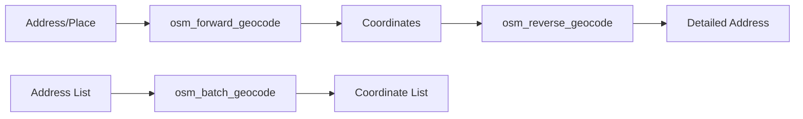
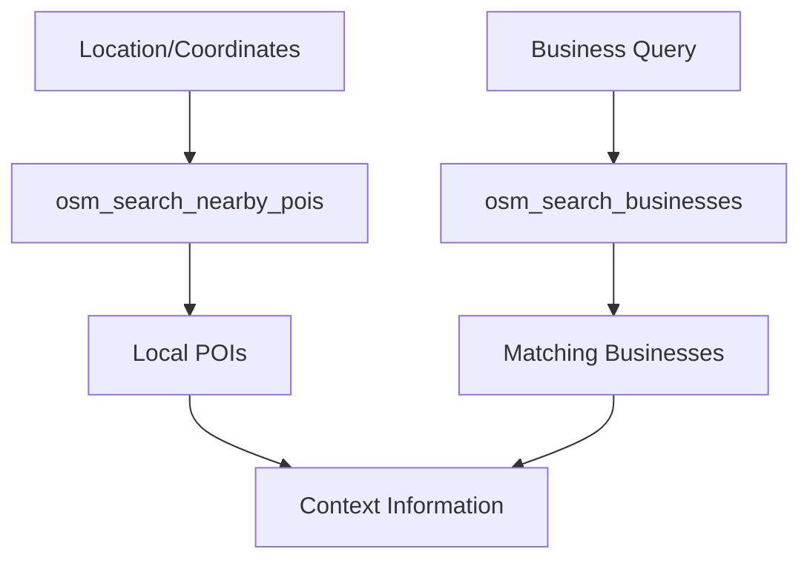
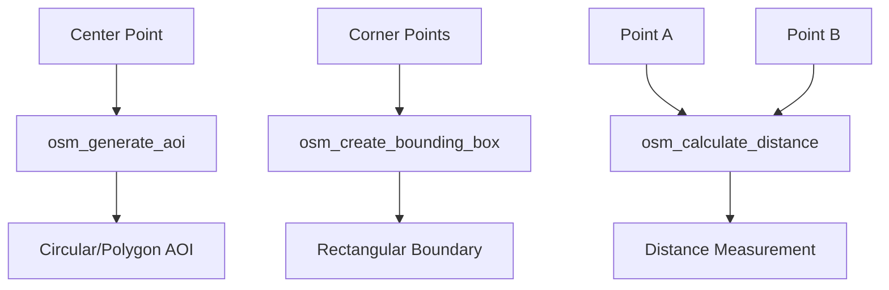

# OpenStreetMap (OSM) Tools Overview

SkyFi MCP Server provides **8 specialized tools** for accessing OpenStreetMap's comprehensive geospatial database for geocoding, search, and geographic analysis.

##  What is OpenStreetMap?

**OpenStreetMap (OSM)** is a collaborative, open-source mapping platform that provides free geographic data worldwide. It's maintained by a global community and offers comprehensive, up-to-date geographic information including addresses, points of interest, and detailed geographic features.

### Key Advantages
- **Global Coverage** - Worldwide geographic data
- **No Usage Limits** - No API quotas or rate restrictions
- **High Accuracy** - Community-maintained, precise data
- **Real-Time Updates** - Continuously updated by contributors
- **Rich Business Data** - Comprehensive POI and business information

##  OSM Tools Categories

###  Geocoding Tools (3 tools)

Convert between addresses and coordinates with high accuracy and global coverage.

| Tool | Description | Primary Use |
|------|-------------|-------------|
| **`osm_forward_geocode`** | Convert address to coordinates | Find location coordinates |
| **`osm_reverse_geocode`** | Convert coordinates to address | Get address from coordinates |
| **`osm_batch_geocode`** | Geocode multiple addresses | Process address lists efficiently |

**Geocoding Workflow:**


###  Search & Discovery (2 tools)

Find points of interest and businesses in specific geographic areas.

| Tool | Description | Primary Use |
|------|-------------|-------------|
| **`osm_search_nearby_pois`** | Find POIs near a location | Discover local services and amenities |
| **`osm_search_businesses`** | Search for specific businesses | Find commercial locations and services |

**Search Workflow:**


###  Geometry & Analysis (3 tools)

Create geographic areas and perform spatial analysis for satellite imagery workflows.

| Tool | Description | Primary Use |
|------|-------------|-------------|
| **`osm_generate_aoi`** | Generate Area of Interest | Create boundaries for satellite searches |
| **`osm_create_bounding_box`** | Create rectangular boundaries | Define search and analysis areas |
| **`osm_calculate_distance`** | Calculate distances between points | Measure spatial relationships |

**Geometry Workflow:**


##  Common OSM Workflows

### 1. Location Discovery & Geocoding

**Scenario**: Converting addresses to coordinates for satellite imagery search

```
1. osm_forward_geocode → Convert "Central Park, NYC" to coordinates
2. osm_reverse_geocode → Verify and get detailed address info
3. osm_search_nearby_pois → Find context (nearby landmarks)
4. osm_generate_aoi → Create search area for satellite imagery
```

### 2. Business Intelligence & Analysis

**Scenario**: Analyzing commercial locations and their spatial relationships

```
1. osm_search_businesses → Find all "coffee shops" in Seattle
2. osm_batch_geocode → Get coordinates for all locations
3. osm_calculate_distance → Measure distances between locations
4. osm_create_bounding_box → Define analysis area
```

### 3. Area Definition for Satellite Imagery

**Scenario**: Creating precise search areas for satellite imagery workflows

```
1. osm_forward_geocode → Find target location coordinates
2. osm_generate_aoi → Create circular or custom AOI
3. Pass AOI to skyfi_archive_search → Find satellite imagery
4. osm_search_nearby_pois → Add context to imagery analysis
```

##  OSM Tool Features

### Universal OSM Features
All OSM tools in the SkyFi MCP Server include:

-  **No Authentication Required** - Direct access to OSM data
-  **Global Coverage** - Worldwide geographic information
-  **High Accuracy** - Community-verified data quality
-  **Real-Time Data** - Current geographic information
-  **No Rate Limits** - Unlimited usage for reasonable requests

### Geocoding Features
-  **Multi-Language Support** - Addresses in various languages
-  **Business Recognition** - Understands business names and brands
-  **Landmark Recognition** - Famous places and points of interest
-  **Global Address Formats** - Supports international address styles
-  **Confidence Scoring** - Quality indicators for results

### Search Features
-  **Category Search** - Find by business type or amenity
-  **Radius Control** - Configurable search distances
-  **Precise Filtering** - Detailed search criteria
-  **Rich Metadata** - Detailed business and POI information
-  **Hierarchical Results** - Organized by relevance and distance

### Geometry Features
-  **Multiple AOI Types** - Circular, rectangular, and custom polygons
-  **Distance Calculations** - Great circle and planar distance methods
-  **Precise Coordinates** - High-precision geographic coordinates
-  **Area Calculations** - Surface area measurements
-  **Map Projection Support** - Various coordinate systems

##  OSM Tools by Use Case

import Tabs from '@theme/Tabs';
import TabItem from '@theme/TabItem';

<Tabs>
<TabItem value="geocoding" label="Geocoding & Addresses" default>

**Converting between addresses and coordinates:**

**Primary Tools:**
- `osm_forward_geocode` - Address to coordinates
- `osm_reverse_geocode` - Coordinates to address
- `osm_batch_geocode` - Multiple address processing

**Best For:**
- Data cleanup and standardization
- Location validation and verification
- Coordinate system conversions
- Address database enrichment
- Map integration and display

**Example Queries:**
- "123 Main Street, Springfield, IL"
- "Eiffel Tower, Paris"
- "Times Square, New York"
- "37.7749, -122.4194"

</TabItem>
<TabItem value="discovery" label="Search & Discovery">

**Finding points of interest and businesses:**

**Primary Tools:**
- `osm_search_nearby_pois` - Local amenities and services
- `osm_search_businesses` - Specific business searches

**Best For:**
- Market research and analysis
- Site selection and planning
- Competitive intelligence
- Local service discovery
- Context for satellite imagery

**Search Categories:**
- Restaurants, cafes, shopping centers
- Hospitals, schools, government offices
- Tourist attractions, hotels, transportation
- Banks, gas stations, parking areas

</TabItem>
<TabItem value="analysis" label="Spatial Analysis">

**Geographic analysis and area definition:**

**Primary Tools:**
- `osm_generate_aoi` - Create analysis boundaries
- `osm_create_bounding_box` - Define rectangular areas
- `osm_calculate_distance` - Measure spatial relationships

**Best For:**
- Satellite imagery search area definition
- Geographic analysis and planning
- Distance and proximity analysis
- Market area definition
- Service area planning

**Analysis Types:**
- Catchment area analysis
- Distance-based market research
- Service accessibility studies
- Location optimization

</TabItem>
<TabItem value="integration" label="SkyFi Integration">

**Preparing data for satellite imagery workflows:**

**Workflow Tools:**
1. `osm_forward_geocode` - Find target coordinates
2. `osm_generate_aoi` - Create search boundary
3. Pass to `skyfi_archive_search` - Find imagery
4. `osm_search_nearby_pois` - Add context

**Integration Benefits:**
- Precise area definition for satellite searches
- Context information for imagery analysis
- Geographic validation before imagery orders
- Location intelligence for monitoring setup

</TabItem>
</Tabs>

##  OSM Best Practices

### 1. Geocoding Optimization
- **Be specific** - Include city, state/country for better accuracy
- **Use landmarks** - Well-known places often geocode more accurately
- **Verify results** - Use reverse geocoding to confirm accuracy
- **Handle batch processing** - Use `osm_batch_geocode` for multiple addresses

### 2. Search Efficiency
- **Use appropriate radius** - Balance coverage with result relevance
- **Filter by category** - Use specific business types for targeted results
- **Check result quality** - Review returned metadata for relevance
- **Combine searches** - Use multiple search tools for comprehensive coverage

### 3. Geometry Accuracy
- **Choose appropriate AOI size** - Match area size to intended use
- **Consider coordinate systems** - Ensure compatibility with satellite imagery tools
- **Validate boundaries** - Check that AOI covers intended area
- **Use consistent units** - Maintain unit consistency across calculations

### 4. Integration with SkyFi
- **Geocode first** - Always validate locations before satellite searches
- **Create appropriate AOIs** - Size areas appropriately for imagery resolution
- **Add context** - Use POI searches to understand area characteristics
- **Verify coverage** - Ensure AOI boundaries align with imagery availability

##  Detailed Tool Documentation

### Geocoding Tools
- **Forward Geocoding (coming soon)** - Convert addresses to coordinates
- **Reverse Geocoding (coming soon)** - Convert coordinates to addresses
- **Batch Geocoding (coming soon)** - Process multiple addresses

### Search Tools
- **Search Nearby POIs (coming soon)** - Find local points of interest
- **Search Businesses (coming soon)** - Find specific businesses

### Geometry Tools
- **Generate AOI (coming soon)** - Create areas of interest
- **Create Bounding Box (coming soon)** - Define rectangular boundaries
- **Calculate Distance (coming soon)** - Measure geographic distances

##  Integration Patterns

### OSM → SkyFi Workflow
```
1. osm_forward_geocode → Find target location
2. osm_generate_aoi → Create search area
3. skyfi_archive_search → Find satellite imagery
4. osm_search_nearby_pois → Add context
```

### Complete Analysis Workflow
```
1. osm_batch_geocode → Process location list
2. osm_calculate_distance → Analyze spatial relationships
3. osm_create_bounding_box → Define analysis boundary
4. skyfi_archive_search → Find relevant imagery
5. osm_search_businesses → Add commercial context
```

### Data Validation Workflow
```
1. osm_forward_geocode → Convert address to coordinates
2. osm_reverse_geocode → Verify address accuracy
3. osm_search_nearby_pois → Validate location context
4. Proceed with confidence to satellite imagery tools
```

##  OSM Data Quality

### Accuracy Indicators
- **Urban Areas** - Generally very high accuracy and detail
- **Rural Areas** - Good coverage with community-maintained data
- **International** - Quality varies by region and contributor activity
- **Business Data** - Regularly updated by community and business owners

### Data Freshness
- **Real-Time Updates** - Changes appear quickly in urban areas
- **Community Driven** - Quality depends on local contributor activity
- **Business Hours** - May not always be current
- **Seasonal Variations** - Some data may be seasonally relevant

---

:::tip Quick Start
New to OSM tools? Start with `osm_forward_geocode` to convert any address to coordinates, then use `osm_generate_aoi` to create search areas for satellite imagery!
:::

:::info OpenStreetMap Community
Learn more about OpenStreetMap and contribute to the project at [openstreetmap.org](https://www.openstreetmap.org). The data you use is maintained by volunteers worldwide!
:::