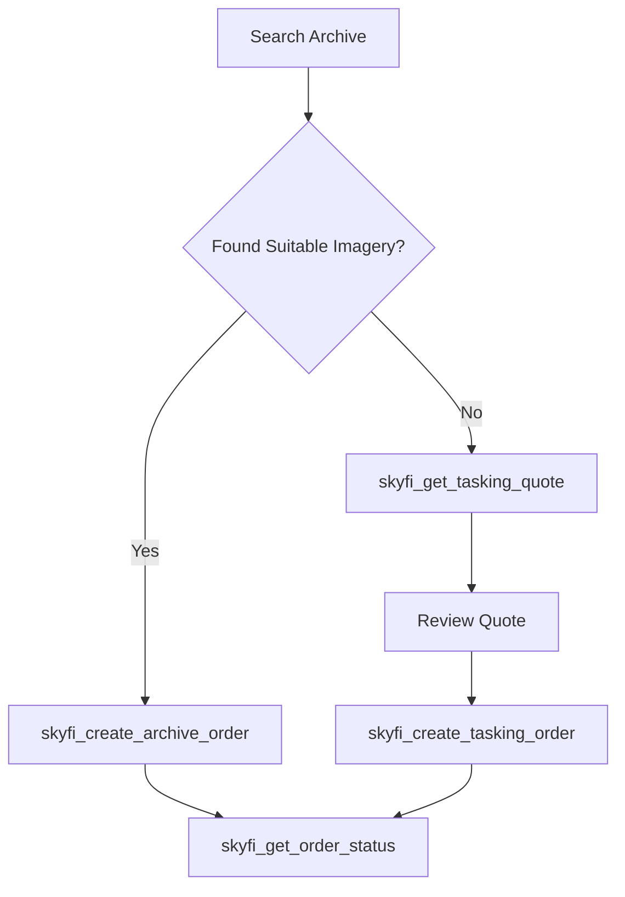
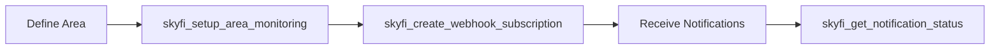
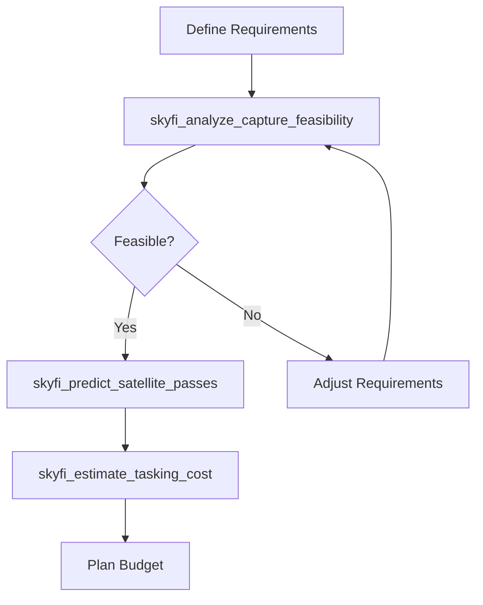

# SkyFi Tools Overview

SkyFi MCP Server provides **13 specialized tools** for accessing satellite imagery and geospatial intelligence through the SkyFi platform.

##  What is SkyFi?

**SkyFi** is a satellite imagery platform that provides on-demand access to high-resolution satellite imagery from multiple satellite constellations. The platform offers both archive imagery (historical captures) and tasking capabilities (commissioning new captures).

### Key Capabilities
- **Multi-Satellite Access** - Access to diverse satellite constellations
- **On-Demand Tasking** - Commission new satellite captures
- **Archive Search** - Explore historical imagery database
- **Real-Time Monitoring** - Set up area surveillance
- **Transparent Pricing** - Clear cost structure and estimates

##  SkyFi Tools Categories

###  Archive & Search Tools (2 tools)

Access and explore SkyFi's comprehensive archive of satellite imagery.

| Tool | Description | Primary Use |
|------|-------------|-------------|
| **`skyfi_archive_search`** | Search imagery archive with filters | Find existing satellite images |
| **`skyfi_archive_details`** | Get detailed image information | View metadata and download options |

**Common Use Cases:**
- Historical analysis and research
- Finding existing imagery for your area of interest
- Comparing imagery across different time periods
- Accessing high-resolution archive data

###  Ordering Tools (4 tools)

Create and manage orders for both archive and new satellite imagery.

| Tool | Description | Primary Use |
|------|-------------|-------------|
| **`skyfi_get_tasking_quote`** | Get pricing quote for new imagery | Required before ordering new captures |
| **`skyfi_create_archive_order`** | Order existing archive imagery | Purchase and download historical images |
| **`skyfi_create_tasking_order`** | Order new satellite captures | Commission new imagery |
| **`skyfi_get_order_status`** | Track order progress | Monitor order fulfillment |

**Ordering Workflow:**


###  Monitoring & Notifications (3 tools)

Set up automated monitoring and notifications for areas of interest.

| Tool | Description | Primary Use |
|------|-------------|-------------|
| **`skyfi_create_webhook_subscription`** | Create notification webhooks | Get real-time alerts |
| **`skyfi_setup_area_monitoring`** | Monitor specific areas | Automated area surveillance |
| **`skyfi_get_notification_status`** | Check notification delivery | Verify webhook status |

**Monitoring Workflow:**


###  Pricing & Analysis (4 tools)

Calculate costs, analyze feasibility, and plan optimal capture timing.

| Tool | Description | Primary Use |
|------|-------------|-------------|
| **`skyfi_calculate_archive_pricing`** | Calculate archive imagery costs | Budget for historical imagery |
| **`skyfi_estimate_tasking_cost`** | Estimate new imagery costs | Plan new capture budgets |
| **`skyfi_analyze_capture_feasibility`** | Analyze capture potential | Assess imagery capture viability |
| **`skyfi_predict_satellite_passes`** | Predict optimal capture windows | Plan timing for new captures |

**Planning Workflow:**


##  Common SkyFi Workflows

### 1. Research & Analysis Workflow

**Scenario**: Academic research requiring historical satellite imagery

```
1. Use OSM tools to geocode your study area
2. skyfi_archive_search → Find historical imagery
3. skyfi_archive_details → Review metadata and quality
4. skyfi_calculate_archive_pricing → Check budget
5. skyfi_create_archive_order → Purchase imagery
6. skyfi_get_order_status → Track delivery
```

### 2. Monitoring & Surveillance Workflow

**Scenario**: Continuous monitoring of infrastructure or environmental changes

```
1. Define area of interest with OSM tools
2. skyfi_setup_area_monitoring → Enable automated monitoring
3. skyfi_create_webhook_subscription → Set up notifications
4. skyfi_predict_satellite_passes → Plan optimal timing
5. skyfi_get_notification_status → Verify monitoring status
```

### 3. Commercial Intelligence Workflow

**Scenario**: Business intelligence requiring new satellite captures

```
1. Define target area and requirements
2. skyfi_analyze_capture_feasibility → Assess viability
3. skyfi_predict_satellite_passes → Find optimal windows
4. skyfi_get_tasking_quote → Get accurate pricing
5. skyfi_create_tasking_order → Commission capture
6. skyfi_get_order_status → Track progress
```

##  SkyFi Authentication

### API Key Format
SkyFi tools require authentication in the format:
```
SKYFI_API_KEY=your-email@example.com:your-api-key-hash
```

### Platform URL
```
SKYFI_URL=https://app.skyfi.com/platform-api/pricing
```

### Additional Configuration
```bash
# Optional: Weather integration
OPENWEATHER_API_KEY=your-weather-api-key

# Optional: Logging and performance
MCP_LOG_LEVEL=INFO
MCP_TIMEOUT=30
```

##  SkyFi Tool Categories by Use Case

import Tabs from '@theme/Tabs';
import TabItem from '@theme/TabItem';

<Tabs>
<TabItem value="archive" label="Archive & Historical" default>

**Working with existing satellite imagery:**

**Primary Tools:**
- `skyfi_archive_search` - Find existing imagery
- `skyfi_archive_details` - Get detailed metadata
- `skyfi_calculate_archive_pricing` - Calculate costs
- `skyfi_create_archive_order` - Purchase imagery

**Best For:**
- Historical analysis and research
- Cost-effective imagery access
- Quick data acquisition
- Comparative studies across time periods

</TabItem>
<TabItem value="tasking" label="New Imagery & Tasking">

**Commissioning new satellite captures:**

**Primary Tools:**
- `skyfi_analyze_capture_feasibility` - Check viability
- `skyfi_predict_satellite_passes` - Plan timing
- `skyfi_get_tasking_quote` - Get pricing
- `skyfi_create_tasking_order` - Commission capture

**Best For:**
- Current/recent imagery needs
- Specific capture requirements
- High-priority time-sensitive projects
- Custom imagery specifications

</TabItem>
<TabItem value="monitoring" label="Monitoring & Alerts">

**Ongoing area surveillance:**

**Primary Tools:**
- `skyfi_setup_area_monitoring` - Enable monitoring
- `skyfi_create_webhook_subscription` - Set notifications
- `skyfi_get_notification_status` - Check status
- `skyfi_predict_satellite_passes` - Plan windows

**Best For:**
- Infrastructure monitoring
- Environmental change detection
- Security and surveillance applications
- Automated alert systems

</TabItem>
<TabItem value="analysis" label="Planning & Analysis">

**Cost analysis and feasibility assessment:**

**Primary Tools:**
- `skyfi_analyze_capture_feasibility` - Assess potential
- `skyfi_estimate_tasking_cost` - Budget planning
- `skyfi_calculate_archive_pricing` - Cost comparison
- `skyfi_predict_satellite_passes` - Timing optimization

**Best For:**
- Project planning and budgeting
- Feasibility studies
- Cost-benefit analysis
- Optimal timing determination

</TabItem>
</Tabs>

##  SkyFi Best Practices

### 1. Cost Optimization
- **Use archive imagery first** - Check existing imagery before tasking
- **Get quotes before ordering** - Always use `skyfi_get_tasking_quote`
- **Compare options** - Use pricing tools to compare archive vs. tasking costs
- **Plan timing** - Use `skyfi_predict_satellite_passes` for optimal windows

### 2. Quality Management
- **Check feasibility** - Use `skyfi_analyze_capture_feasibility` before tasking
- **Review metadata** - Use `skyfi_archive_details` to assess quality
- **Monitor weather** - Consider weather conditions for new captures
- **Verify delivery** - Use `skyfi_get_order_status` to track progress

### 3. Workflow Efficiency
- **Batch operations** - Group similar requests when possible
- **Set up monitoring** - Use webhooks for automated notifications
- **Plan ahead** - Use prediction tools for optimal timing
- **Verify setup** - Check notification status after configuration

##  Detailed Tool Documentation

### Archive & Search
- **Archive Search (coming soon)** - Find satellite imagery in SkyFi's archive
- **Archive Details (coming soon)** - Get detailed image metadata

### Ordering
- **Get Tasking Quote (coming soon)** - Get pricing for new imagery
- **Create Archive Order (coming soon)** - Order existing imagery
- **Create Tasking Order (coming soon)** - Order new captures
- **Get Order Status (coming soon)** - Track order progress

### Monitoring
- **Setup Area Monitoring (coming soon)** - Monitor specific areas
- **Create Webhook Subscription (coming soon)** - Set up notifications
- **Get Notification Status (coming soon)** - Check webhook status

### Analysis
- **Calculate Archive Pricing (coming soon)** - Price archive imagery
- **Estimate Tasking Cost (coming soon)** - Estimate new imagery costs
- **Analyze Capture Feasibility (coming soon)** - Assess capture potential
- **Predict Satellite Passes (coming soon)** - Plan optimal timing

##Integration with OSM Tools

SkyFi tools work seamlessly with OSM tools for complete geospatial workflows:

```
OSM: Geocoding → SkyFi: Search → SkyFi: Order → SkyFi: Monitor
```

**Example Integration:**
1. `osm_forward_geocode` - Find coordinates for "Downtown Austin"
2. `osm_generate_aoi` - Create 5km radius area
3. `skyfi_archive_search` - Find imagery in that area
4. `skyfi_calculate_archive_pricing` - Check costs
5. `skyfi_create_archive_order` - Purchase imagery

---

:::tip Getting Started
New to SkyFi tools? Start with `skyfi_archive_search` to explore available imagery in your area of interest!
:::

:::info SkyFi Platform
Learn more about the SkyFi platform at [skyfi.com](https://skyfi.com) or check out the [SkyFi API documentation](https://app.skyfi.com/platform-api/docs).
:::